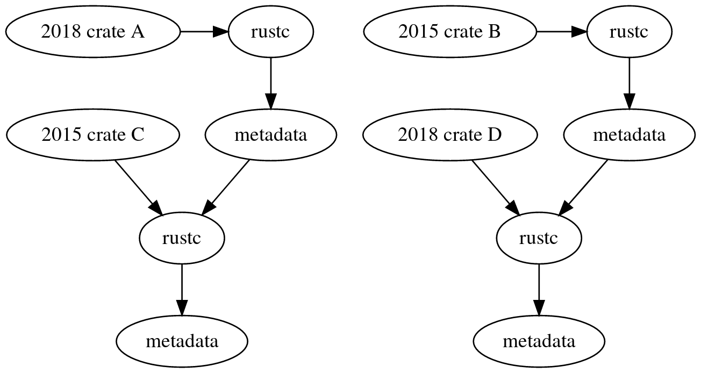

---
# Rust 2018 Edition

* What is it?
* Why is this happening?
* When does the fun start?
* How is that even possible?

---
## What is it?

---
### What is it **not**?

* A breaking change
* An ecosystem split (aka not the Python 2 vs 3 desaster)

---
### Ok, back to "what is it?"

* Language cleanups
* Convenience features
* An *opt-in* breaking change

---
### Wait! You said "no breaking changes"

You opt-in to breaking changes by adding

```toml
edition = '2018'
```

to your `Cargo.toml`

---
### So... now I need to update my code?

Yes, no, maybe. In that order.

* Yes your code needs changing
* No you don't need to do it
    * Running `cargo fix` will do it automatically
* Maybe you run into edge cases

---
### Do I need to upgrade all my crates now?

No. You can

* use 2018 edition crates from 2015 edition crates.
* use 2015 edition crates from 2018 edition crates.

---
### What is this sorcery!?



---
## Why is this happening?

---
### Stability without stagnation

Suboptimal language features

* Upfront planning could not reveal them
    * needed actual long term use
* Deadlines meant compromises
* Library and language development obsoleted other features

---
## When does the fun start?

* 07.12.18 (This friday!) on stable
* on beta already right now

---
## Features? Features!

* no more `extern crate`
* `pub(crate)`
* `fn main() -> Result<(), MyError>`
* non lexical lifetimes
* keyword reservations (`async`, `await`)
* stable embedded development
* stable clippy

---

```rust
use std::ops::Index; // 2015 special case
use rand::range; // 2018 without `extern crate rand`
```

---

```rust
// in mycrate's `lib.rs`
pub mod foo {
    pub(crate) fn bar() {}
}
```

Other crates cannot call `mycrate::foo::bar()`

---

```rust
use std::io::Error;
fn main() -> Result<(), Error> {
    let file = File::open("foo")?;
    // ...
}
```

Reports the error on the command line and sets the exit code if not `Ok`

---
### non lexical lifetimes

The killer feature of the 2018 edition:

write code as you mean it and not as the borrow checker
understands it

---

the borrow checker has been rewritten on

a control flow representation (the MIR)

instead of

a syntax tree (the HIR)

---

```rust
let mut x = 42;
let y = &x;
x = 5; // ok
let z = y; // error
```
